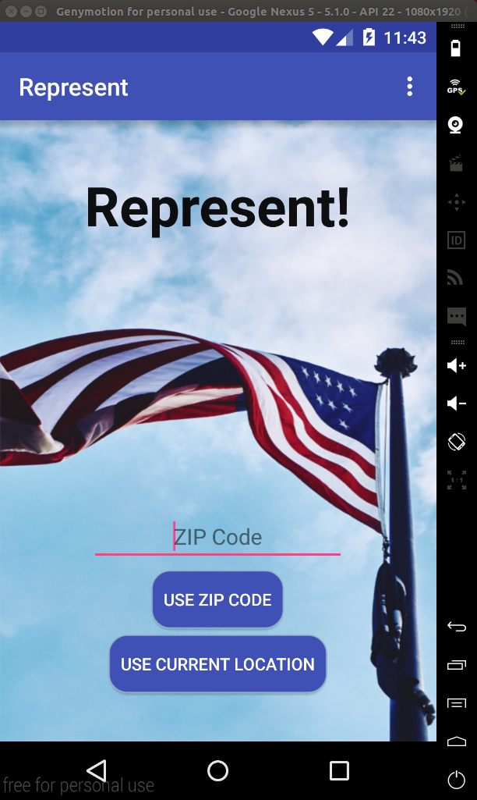
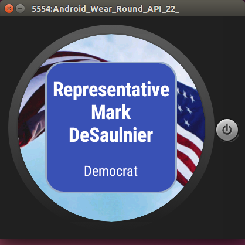
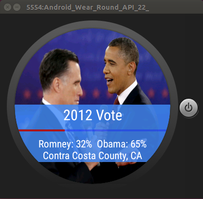

# PROG 02: Represent!

"Represent!" lets you know what your Congressional Representatives have been up to recently. Using your ZIP code or current location you can find your local Representatives and see their most recent Tweets. You can also see the Bills they've sponsored recently, which committees they're on, and when their Congressional term ends. 

If you have a smartwatch you can also see the 2012 Presidential election results for your county. You can even shake the watch to learn about the Representatives from a random county anywhere in the United States. How cool!

## Authors

Lennon Ganz ([lnganz@berkeley.edu](mailto:lnganz@berkeley.edu))

## Demo Video

See "CS160 Represent! PROG-02-C" (https://www.youtube.com/watch?v=zQ0XvJKH0dE)

## Screenshots

## Acknowledgments

* Thanks to StackOverflow as always.
* Thanks to Google for having good Android documentation.
* Thanks to the Berkeley CS160 staff for the API guides and Watch-to-Phone interaction starter code.
